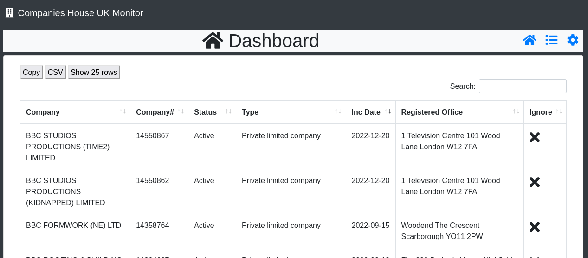
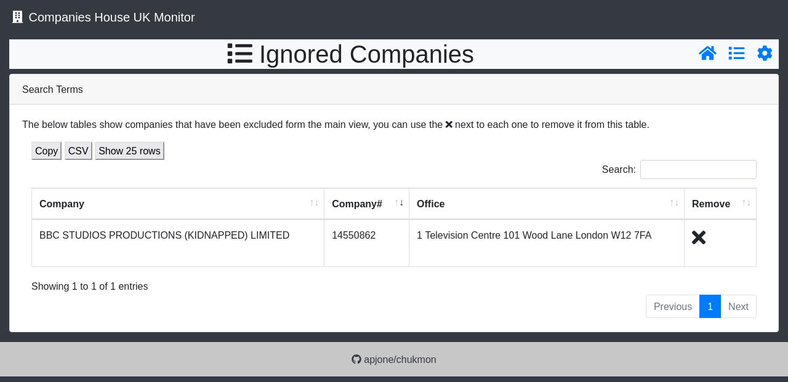
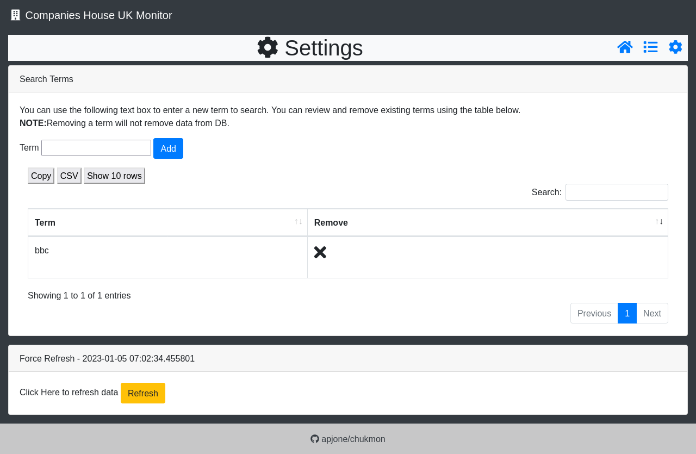

# chukmon: Companies House Monitor

# Contents
1. [About](#about)
2. [Screenshots](#screenshots)
3. [Install](#install)
    * [Requirements](#requirements)
    * [SetUp](#setup)
4. [ToDo](#todo-list)
# About
This is a python flask application which will retrieve company information from Companies House and display it in a dashboard. You can exclude companies from the main view as well as use the responsive search and/or export functions of the tables. 

This might be useful for OSINT or monitoring for `look-a-like` companies being setup.

# Screenshots

## Dashboard


## Ignored Companies


# Settings


# Install

## Requirements
```python
certifi==2022.12.7
charset-normalizer==2.1.1
click==8.1.3
Flask==2.2.2
idna==3.4
itsdangerous==2.1.2
Jinja2==3.1.2
MarkupSafe==2.1.1
python-dotenv==0.21.0
requests==2.28.1
urllib3==1.26.13
Werkzeug==2.2.2
```

## Setup

1. Clone Repo
```bash
git clone https://github.com/apjone/chukmon.git
```

2. Create & activate virtual environment
```bash
cd chukmon
python3 -m venv venv
source venv/bin/activate
```

3. Install requirements
```bash
pip3 install -r requirments.txt
```

4. Create `.env` and update as required
```bash
cp env.default .env
```

### Default Settings
```python
# environment variables should be defined in .env
DB_FILE =  "../chukmon.sqlite"
APP_PORT = "8181"
APP_HOST = "127.0.0.1"
POLL_TIME = "43200
```

5. Run application
```bash
python3 chukmon.py
```

7. Access web console via default settings [http://127.0.0.1:8181](http://127.0.0.1:8181)

8. Add first search term under settings and force refresh

9. View results back on the dashboard.

[todo]

# ToDo List
* Add Install / Setup instructions
* Purge DB from Web Console
* Email notifications of new companies
* Add filter options
    * Status
    * Incorporation Date
